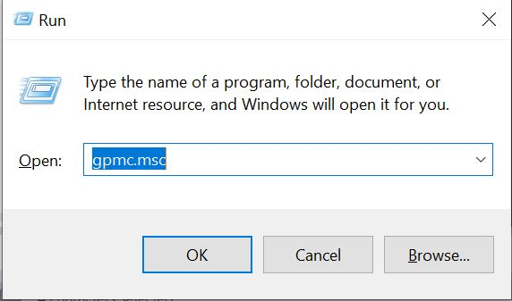
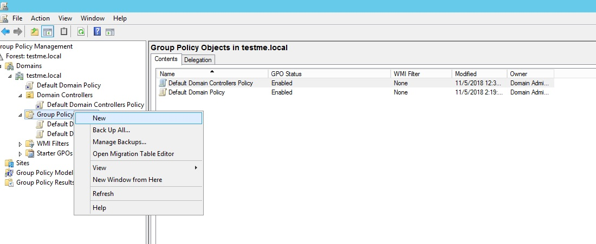
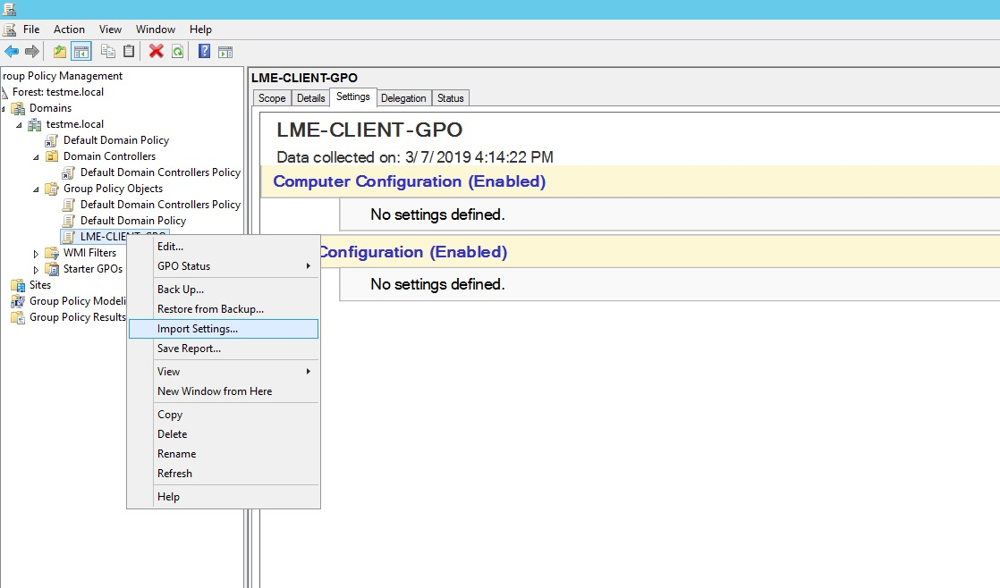
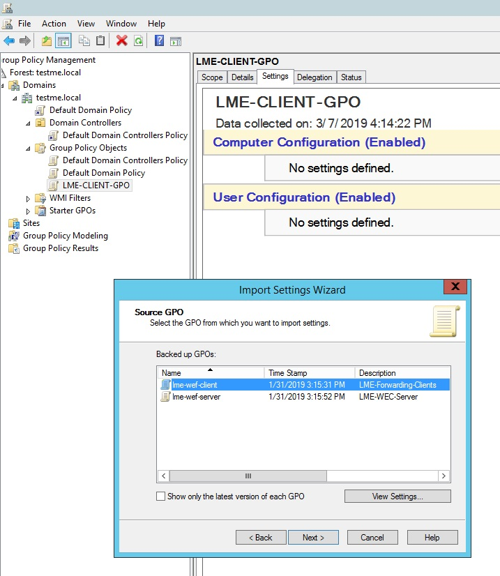
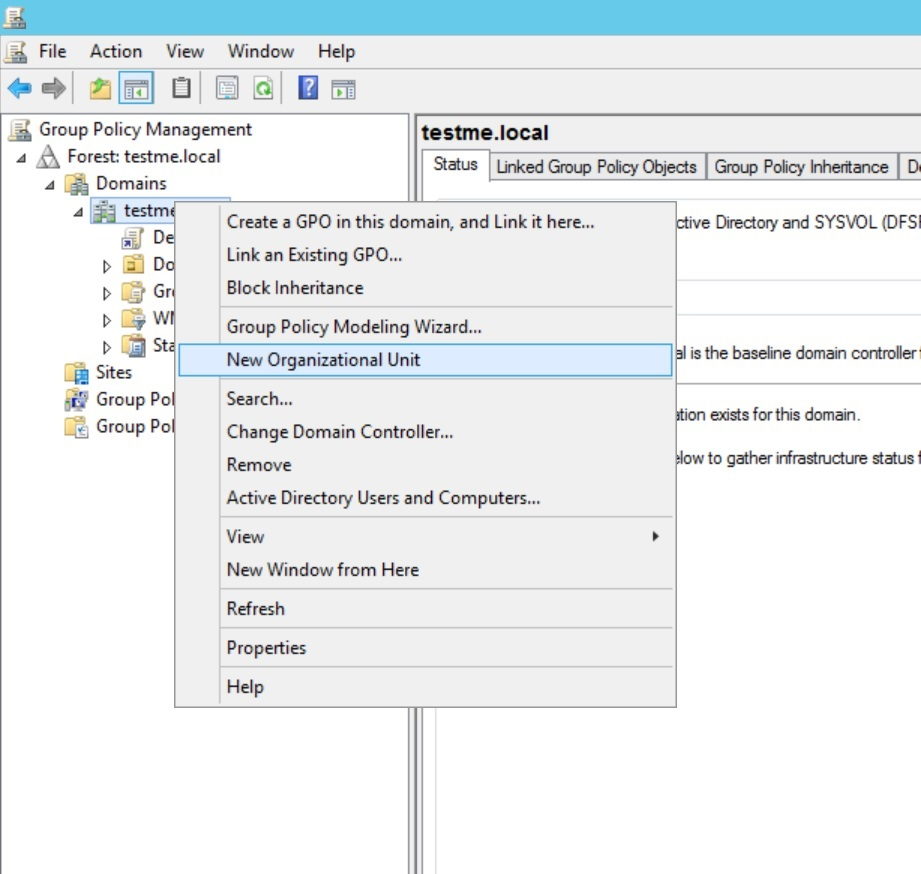
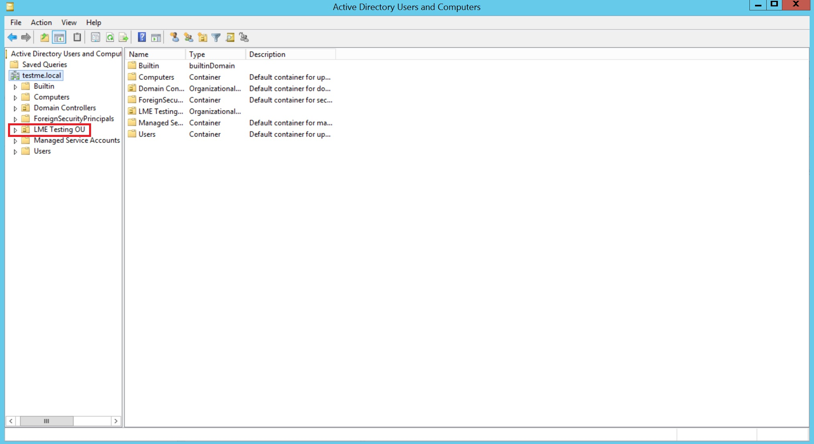
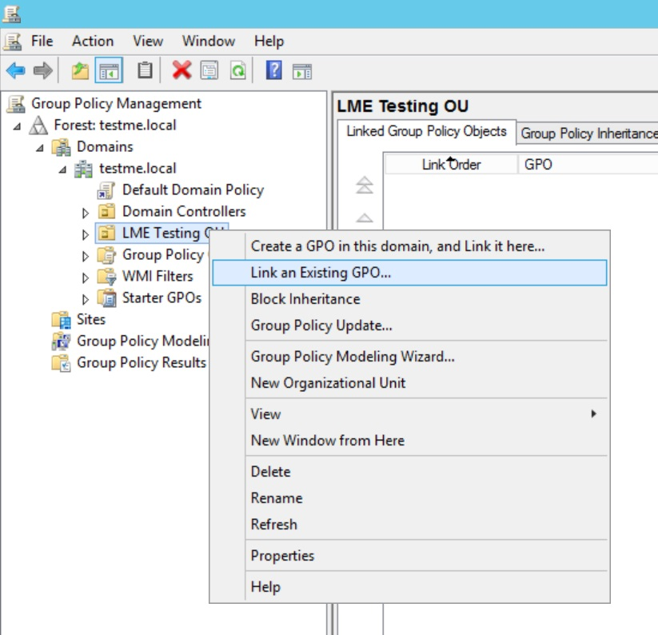
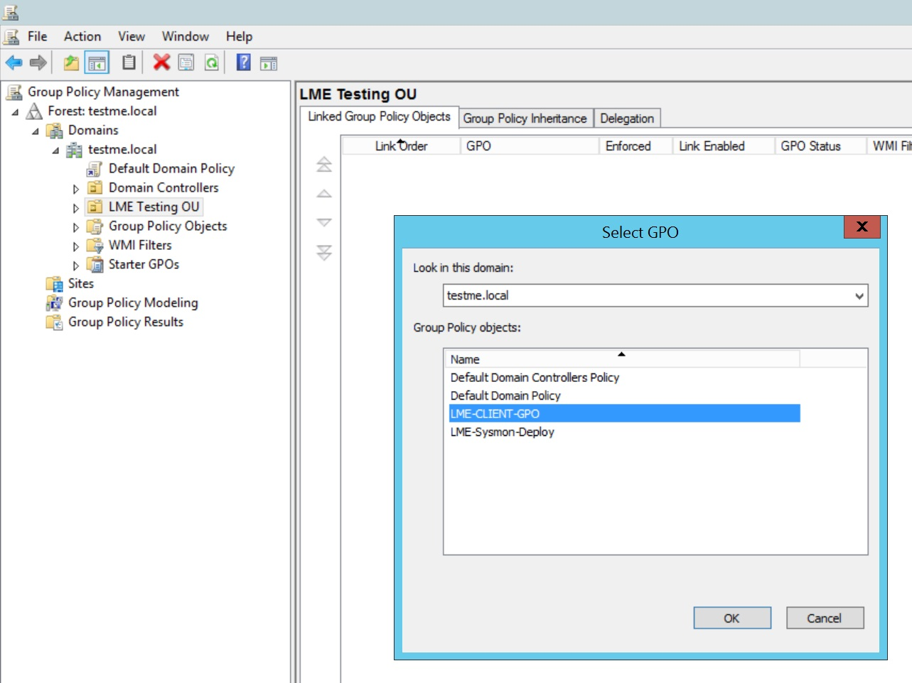

# 1 How to GPO
This guide is intended to be a step by step guide on how to import and manage GPOs with Organisational Units in Microsoft Active Directory

## 1.1 How To Import a GPO

### 1.1.1 - Opening GPMC
Open the Group Policy Management Console by running ```gpmc.msc```, You can run this command by pressing windows key + r.


<p align="center">
Figure 1: Launching GPMC
</p>

### 1.1.2 - Creating the GPO object
Create a new Group Policy Object, for LME you will need at least two of these (or three if you choose to use GPO as a Sysmon Deployment method)


<p align="center">
Figure 2: Create a new GPO object
</p>

Choose a sensible name for this object (lme-wef-client/lme-wef-server/lme-sysmon-deploy)

<p align="center">
Figure 3: Name the new GPO object
</p>


### 1.1.3 Import Settings
when asked to backup existing gpo just press next
"Backup location (select the backup folder from which you will import setting)" please select the GPO folder contained within the zip you downloaded.


<p align="center">
Figure 4: Import an existing object
</p>

After selecting the folder which contains the GPOs you will be prompted for which GPO you wish to import from the folder, make sure you import the one that matches the name of the object you just made. For example if you have made an object called lmeclients import the lme-wef-clients gpo (as shown in figure 5 below)


<p align="center">
Figure 5: Select the backup name
</p>

If the import is successful and there are no errors you should be presented with something similar to the image in Figure 6


<p align="center">
Figure 6: Import finished screen
</p>


## 1.2 Organisational units (OU)

What is an Organisational Unit? 
An Orgnaisational Unit can in its simplest form be thought of as a folder to contain Users, Computers and groups.
OUs can be used to select a subset of computers that you want to be included in the LME Client group for testing before rolling out LME site wide.


### 1.2.1 - How to make an OU
To make an Organisational unit right click on the domain and select new Organisational unit as seen below.


<p align="center">
Figure 7: Making a new OU
</p>

### 1.2.2 - Adding clients/servers to OU

To add Client machines, Servers or security group to a specified OU:

Open Active Directory users and computers


<p align="center">
Figure 8: Open Active Directory users and computers
</p>

Find the machine(s) that you wish to be in the group and drag and drop the machines into the group.


### 1.2.3 - How to link a GPO to an OU

To 'activate' the GPOs that you previously imported you need to link these GPOs to the OUs you want to use. 
To create these right click on the OU that you wish to be linked to a GPO


<p align="center">
Figure 9: Create a new GPO link
</p>

Select the target GPO from the list and press ok.


<p align="center">
Figure 10: Select the target GPO
</p>

